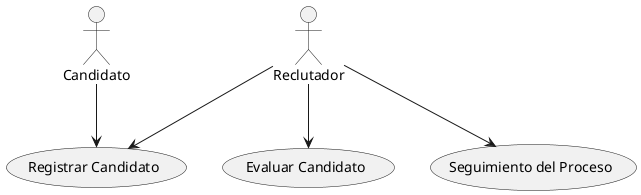
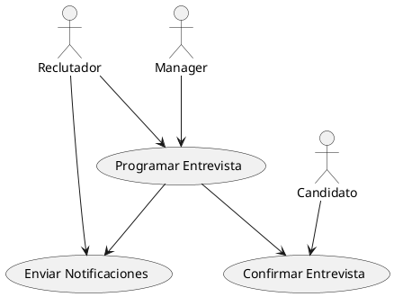
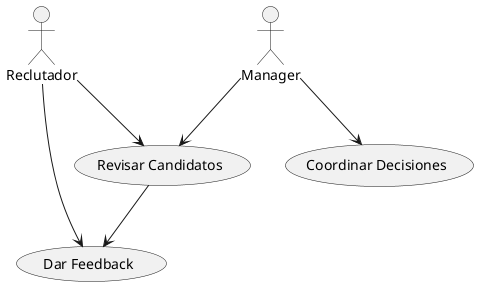
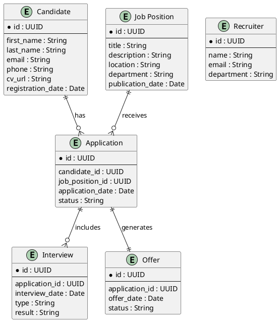
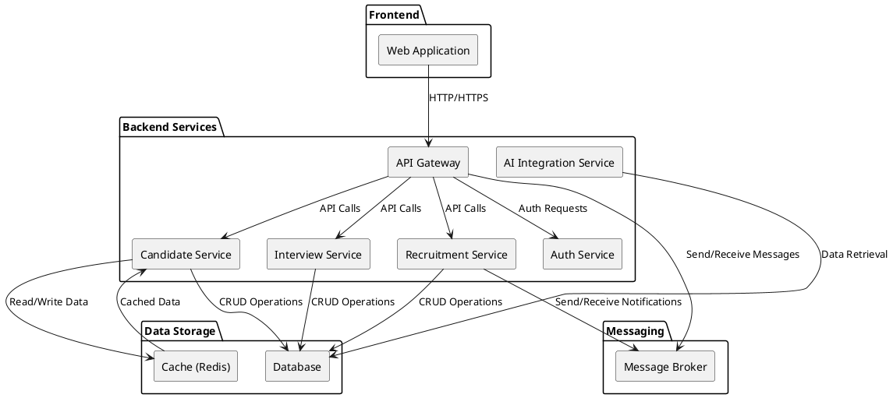

# LTI - Applicant Tracking System (ATS)

## 1. Descripción del Software LTI
LTI es una solución innovadora de Applicant Tracking System (ATS) diseñada para transformar el proceso de reclutamiento. Su objetivo es optimizar la gestión de candidatos y agilizar la toma de decisiones en los departamentos de recursos humanos, integrando automatización e inteligencia artificial para ofrecer una experiencia de usuario superior.

## 2. Valor Añadido y Ventajas Competitivas
- **Eficiencia Operativa:** Automatiza tareas repetitivas y simplifica la gestión de candidatos, reduciendo el tiempo dedicado a procesos manuales.
- **Colaboración en Tiempo Real:** Facilita la comunicación entre reclutadores y managers, permitiendo decisiones conjuntas y coordinadas.
- **Inteligencia Artificial Integrada:** Utiliza algoritmos de IA para analizar currículos, priorizar candidatos y sugerir acciones, mejorando la calidad de las contrataciones.
- **Experiencia de Usuario Personalizada:** Interfaz intuitiva y adaptable a las necesidades específicas de cada empresa.
- **Escalabilidad y Flexibilidad:** Se integra fácilmente con otras herramientas y sistemas de HR, permitiendo crecer y adaptarse al mercado.

## 3. Funciones Principales
- **Gestión de Candidatos:** Registro, seguimiento y evaluación de candidatos a lo largo de todo el proceso de reclutamiento.
- **Automatización de Procesos:** Programación de entrevistas, envíos automáticos de notificaciones y recordatorios para agilizar los procesos internos.
- **Análisis y Reportes:** Generación de informes y análisis en tiempo real para mejorar la toma de decisiones basadas en datos.
- **Colaboración Interdepartamental:** Herramientas que permiten la interacción y coordinación entre diferentes miembros del equipo de recursos humanos.
- **Integración con Herramientas Externas:** Conectividad con sistemas de gestión de datos, redes sociales y plataformas de evaluación para centralizar toda la información.

## 4. Lean Canvas - Modelo de Negocio
```lean
| Sección               | Detalle                                                                                                                                                       |
|-----------------------|---------------------------------------------------------------------------------------------------------------------------------------------------------------|
| **Problema**          | Procesos de reclutamiento lentos y manuales, falta de integración de datos y baja colaboración entre reclutadores y managers.                                  |
| **Segmentos de Cliente** | Departamentos de recursos humanos en empresas medianas y grandes, agencias de reclutamiento.                                                                    |
| **Propuesta de Valor**  | Plataforma ATS que automatiza y optimiza el proceso de contratación mediante el uso de IA, mejorando la eficiencia operativa y la colaboración en tiempo real. |
| **Solución**          | Un sistema integral que centraliza la gestión de candidatos, automatiza tareas críticas y proporciona análisis predictivos para apoyar la toma de decisiones.  |
| **Canales**           | Ventas directas, marketing digital, colaboraciones con consultoras de RRHH, ferias de empleo y tecnología.                                                      |
| **Fuentes de Ingresos** | Suscripción mensual/anual, licencias corporativas, servicios de consultoría e integración personalizada.                                                       |
| **Estructura de Costos** | Desarrollo y mantenimiento de la plataforma, infraestructura tecnológica, costos de marketing y soporte técnico.                                                |
| **Métricas Clave**    | Tasa de adopción, retención de clientes, reducción del tiempo de contratación, satisfacción del usuario.                                                         |
| **Ventaja Injusta**   | Integración única de automatización e inteligencia artificial que permite decisiones basadas en datos en tiempo real, generando un ahorro significativo en tiempo y recursos. |
```

# Casos de Uso Principales para el Sistema LTI

## 1. Gestión de Candidatos

### Descripción Detallada
Este caso de uso permite a los reclutadores registrar nuevos candidatos, realizar un seguimiento de su progreso a lo largo del proceso de selección y evaluar su idoneidad.  
**Actores Involucrados:**  
- **Reclutador:** Inicia y gestiona el proceso de registro y evaluación de candidatos.  
- **Candidato:** Proporciona información personal y profesional durante el proceso de registro.

### Diagrama UML de Casos de Uso


---

## 2. Gestión de Entrevistas

### Descripción Detallada
En este caso de uso se abordan las actividades relacionadas con la programación, notificación y confirmación de entrevistas.  
**Actores Involucrados:**  
- **Reclutador:** Organiza y coordina las entrevistas.  
- **Candidato:** Confirma y participa en las entrevistas programadas.  
- **Manager:** Colabora en la toma de decisiones y en la coordinación de entrevistas críticas.

### Diagrama UML de Casos de Uso


---

## 3. Colaboración entre Reclutadores y Managers

### Descripción Detallada
Este caso de uso se centra en la coordinación y el intercambio de feedback entre reclutadores y managers para facilitar la toma de decisiones durante el proceso de selección.  
**Actores Involucrados:**  
- **Reclutador:** Presenta información y propuestas sobre candidatos.  
- **Manager:** Revisa las propuestas y aporta feedback para la selección final.

### Diagrama UML de Casos de Uso

# Data Model for the LTI System

## 1. Main Entities
The data model for LTI includes the following key entities:
- **Candidate**: Represents a person applying for a job position.
- **Recruiter**: Represents the individual managing the recruitment process.
- **Job Position**: Represents the job opening for which a candidate can apply.
- **Application**: Represents a candidate's application for a job position.
- **Interview**: Represents the scheduling and evaluation of interviews.
- **Offer** (optional): Represents the job offer extended to a candidate.

## 2. Entity Attributes
- **Candidate**
  - `id: UUID`
  - `first_name: String`
  - `last_name: String`
  - `email: String`
  - `phone: String`
  - `cv_url: String`
  - `registration_date: Date`
- **Recruiter**
  - `id: UUID`
  - `name: String`
  - `email: String`
  - `department: String`
- **Job Position**
  - `id: UUID`
  - `title: String`
  - `description: String`
  - `location: String`
  - `department: String`
  - `publication_date: Date`
- **Application**
  - `id: UUID`
  - `candidate_id: UUID`
  - `job_position_id: UUID`
  - `application_date: Date`
  - `status: String` (e.g., "Pending", "In Process", "Rejected", "Hired")
- **Interview**
  - `id: UUID`
  - `application_id: UUID`
  - `interview_date: Date`
  - `type: String` (e.g., "Phone", "In-Person", "Virtual")
  - `result: String` (e.g., "Approved", "Rejected", "Pending")
- **Offer** (optional)
  - `id: UUID`
  - `application_id: UUID`
  - `offer_date: Date`
  - `status: String` (e.g., "Extended", "Accepted", "Rejected")

## 3. Relationships Between Entities
- **Candidate** and **Application**:  
  A candidate can have multiple applications (one-to-many relationship). Each application belongs to a single candidate.
- **Job Position** and **Application**:  
  A job position can receive multiple applications (one-to-many relationship). Each application is associated with a single job position.
- **Application** and **Interview**:  
  An application can have one or more interviews (one-to-many relationship). Each interview is linked to one application.
- **Application** and **Offer**:  
  An application can generate at most one offer (one-to-one relationship).

## 4. Data Model Diagram



# High-Level Architecture for the LTI ATS System

## 1. Overall Architecture Description
The LTI ATS system is designed as a scalable and modular solution to streamline recruitment processes. The system is divided into several key components:

- **Frontend Web Application:**  
  A responsive user interface for recruiters, managers, and candidates. Built using modern web frameworks (e.g., React, Angular, or Vue).

- **Backend API:**  
  A set of RESTful (or GraphQL) services responsible for business logic, candidate management, and integration with other components.

- **Database:**  
  A relational or NoSQL database for storing candidate data, job positions, applications, interviews, and more.

- **AI Integration Service:**  
  A dedicated service leveraging machine learning models to assist in candidate ranking, resume parsing, and predictive analytics.

- **Message Queues:**  
  Used for asynchronous processing of tasks such as notifications, email alerts, and data processing workflows.

- **Authentication and Authorization Service:**  
  Ensures secure access through token-based authentication (e.g., OAuth 2.0, JWT) and manages user permissions.

- **Integration Layer:**  
  Interfaces for third-party services (e.g., HR tools, scheduling systems) to facilitate data exchange and synchronization.

These components communicate over secure APIs and message brokers, ensuring loose coupling and high scalability. The system is deployed using containerization (e.g., Docker) and orchestrated via platforms like Kubernetes, providing resilience and efficient resource utilization.

## 2. Technologies and Patterns
- **Architectural Style:** Microservices architecture to ensure modularity and scalability.
- **API Communication:** RESTful APIs or GraphQL for efficient client-server interactions.
- **Data Caching:** Implementation of caching layers (e.g., Redis) to improve performance.
- **Load Balancing:** Use of load balancers (e.g., NGINX, HAProxy) to distribute traffic evenly.
- **Containerization:** Docker containers managed by Kubernetes or similar orchestration platforms.
- **Messaging:** Message brokers like RabbitMQ or Kafka for asynchronous communication.
- **Security:** OAuth 2.0, JWT, and other security best practices for authentication and authorization.

## 3. High-Level Architecture Diagram


# AI Integration Service - Component-Level C4 Diagram and Description

## Component Description
The **AI Integration Service** is a dedicated component within the LTI ATS system that leverages machine learning to analyze candidate data and provide ranking, recommendations, and predictive analytics. Its main functionalities include:
- **Data Processing:** Extracting and processing candidate information using ML algorithms.
- **Candidate Ranking:** Generating ranking scores and recommendations based on candidate profiles.
- **Predictive Analytics:** Offering insights and forecasts to support recruitment decisions.
- **Integration:** Interacting with the API Gateway, Database, and Message Broker to retrieve data, store analysis results, and handle asynchronous processing tasks.

**Interactions with Other Components:**
- **API Gateway:** Receives candidate data requests and forwards them to the AI Integration Service.
- **Database:** Supplies candidate records and stores the output of AI analyses.
- **Message Broker:** Facilitates asynchronous communications such as batch processing and notifications.
- **Other Services:** Collaborates with candidate management and interview scheduling services as needed.

## Detailed C4 Diagram (Component Level)
```plantuml
@startuml
!define C4P https://raw.githubusercontent.com/plantuml-stdlib/C4-PlantUML/release/1-0/C4_Container.puml
!includeurl C4P

' Define a sample actor (if needed)
Person(user, "User", "Recruiters/Managers", "Uses the system for decision-making based on AI insights")

' Define the system boundary for the LTI ATS System
System_Boundary(lti, "LTI ATS System") {
    Container(api, "API Gateway", "Handles incoming API requests and routes them", "REST/HTTP")
    Container(ai, "AI Integration Service", "Processes candidate data, performs ranking, and provides predictive analytics", "Python/Java")
    Container(db, "Database", "Stores candidate and recruitment data", "PostgreSQL")
    Container(mq, "Message Broker", "Manages asynchronous messaging", "RabbitMQ")
}

' Define interactions between components
Rel(user, api, "Sends data requests", "HTTP/HTTPS")
Rel(api, ai, "Forwards candidate data for AI processing", "REST/HTTP")
Rel(ai, db, "Reads candidate data and writes analysis results", "JDBC/ORM")
Rel(ai, mq, "Publishes/Consumes messages for batch processing", "AMQP")
Rel(api, db, "Performs direct CRUD operations", "JDBC/ORM")

@enduml
```

